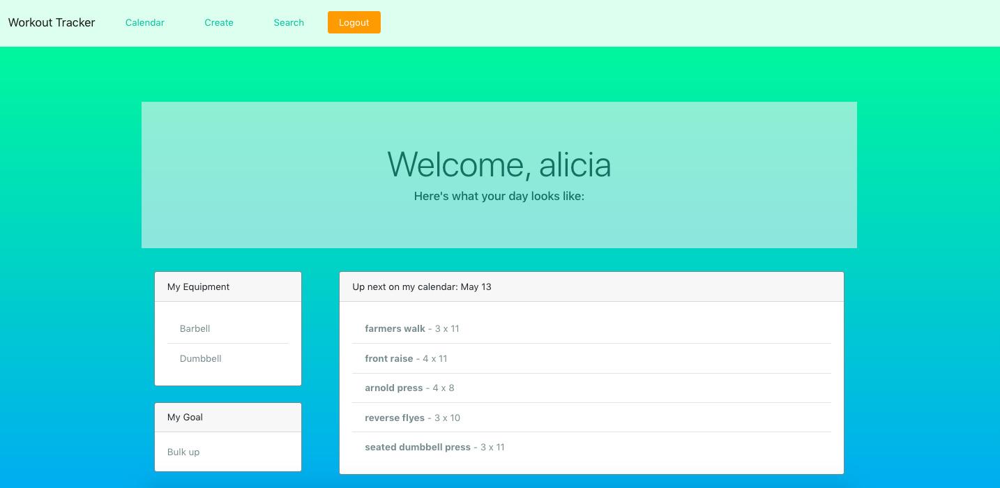

# Workout Planner

## User Story

AS a busy fitness enthusiast  
I WANT an app that will quickly and efficiently create a workout schedule  
SO THAT I can spend the time saved on more important things.

## About

This app allows a user to create a login and save their fitness goals and available workout equipment.  The app will then generate a 2-month workout for the user using these parameters.  On each visit, the page will update to show the user's next upcoming workout.

## Technologies used

  
  
  
  

## Deployed app

You can access Workout Planner [here](https://workout-planner296.herokuapp.com/) - powered by Heroku

## Screenshot

## Contibutions

If you find any issues with the app, feel free to fork a branch, make the necessary adjustments, and push the branch up.  Leave a detailed message about what you changed, and we will try to merge successful changes as soon as possible!

## Future Development

- Give the search tab the functionality to add to other workouts.

- Make the workout generator algorithm more modular.

- Allow the user to delete a workout plan and build a new one from scratch.